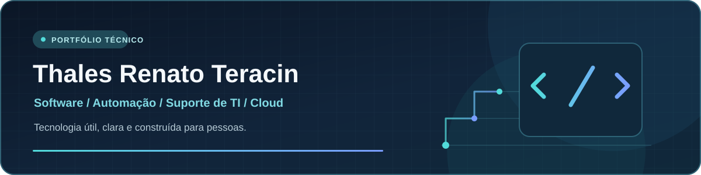

  

  

    <a href="https://www.linkedin.com/in/thalesteracin">LinkedIn</a> ·
    <a href="https://thalesteracin.link/">Cartão digital</a> ·
    <a href="https://portfolio-thales-teracin.thrteracin.chatgpt.site/">Portfólio</a> ·
    <a href="mailto:thrteracin@gmail.com">E-mail</a>
  

## Olá, eu sou Thales

Estudo **Sistemas de Informação** e construo aplicações, automações e ferramentas para resolver problemas concretos. Minha experiência com suporte técnico e ensino de informática orienta a forma como desenvolvo: busco interfaces claras, procedimentos documentados e soluções que façam sentido para quem vai usá-las.

Atualmente exploro **desenvolvimento de software, ferramentas para Windows, arquitetura em nuvem e IA aplicada**. A certificação AWS Cloud Practitioner está em preparação; concluí o curso digital AWS Cloud Practitioner Essentials.

## Projetos em destaque

| Projeto | O que você encontra | Tecnologias |
| :--- | :--- | :--- |
| **[WinCare Pro](https://github.com/ThalesTeracin/Otimiza)** | Aplicativo desktop de diagnóstico, manutenção e otimização do Windows, com confirmações para ações sensíveis e histórico local. [Ver versão](https://github.com/ThalesTeracin/Otimiza/releases/tag/v0.2.0). | Python · PySide6 · SQLite |
| **[SGI — Sistema de Gestão de Inspeções](https://github.com/ThalesTeracin/SGI)** | Projeto de SaaS para inspeções técnicas, com gestão de equipamentos, laudos, painel e portal do cliente. | TypeScript · React · Express · Prisma |
| **[MILK](https://github.com/ThalesTeracin/MILK)** | Assistente de desktop para Windows com conversa por texto e voz, fila de tarefas, memória e confirmação antes de ações em arquivos. | Python · Windows · automação |
| **[MemPure](https://github.com/ThalesTeracin/mempure)** | Ferramenta para observar memória, processos e diagnósticos do Windows, com histórico e visualização de métricas. | Python · Streamlit · psutil |

Também mantenho o **[TRT CRM Pro](https://github.com/ThalesTeracin/trt-crm-pro-4.0-ultimate)**, projeto de CRM e gestão.

## Tecnologias que uso e estudo

**Desenvolvimento:** Python, JavaScript, TypeScript, React, Node.js, Git e GitHub  
**Desktop e suporte:** Windows, PowerShell, PySide6, diagnóstico e documentação técnica  
**Dados e nuvem:** SQLite, Prisma e fundamentos de AWS

> Os repositórios mostram o estágio e as instruções de cada projeto. Código público não significa, por si só, serviço implantado em produção.

## Vamos conversar

Estou aberto a oportunidades em **desenvolvimento, suporte de TI, automação e operações de tecnologia**. Para conversar sobre trabalho ou colaborar em um projeto, use o [LinkedIn](https://www.linkedin.com/in/thalesteracin) ou escreva para [thrteracin@gmail.com](mailto:thrteracin@gmail.com).
